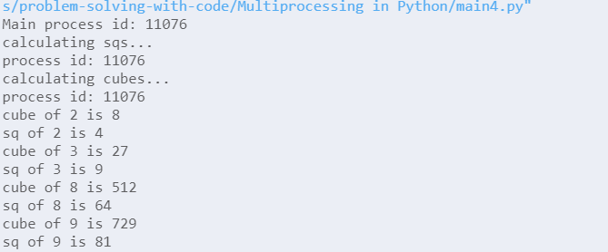
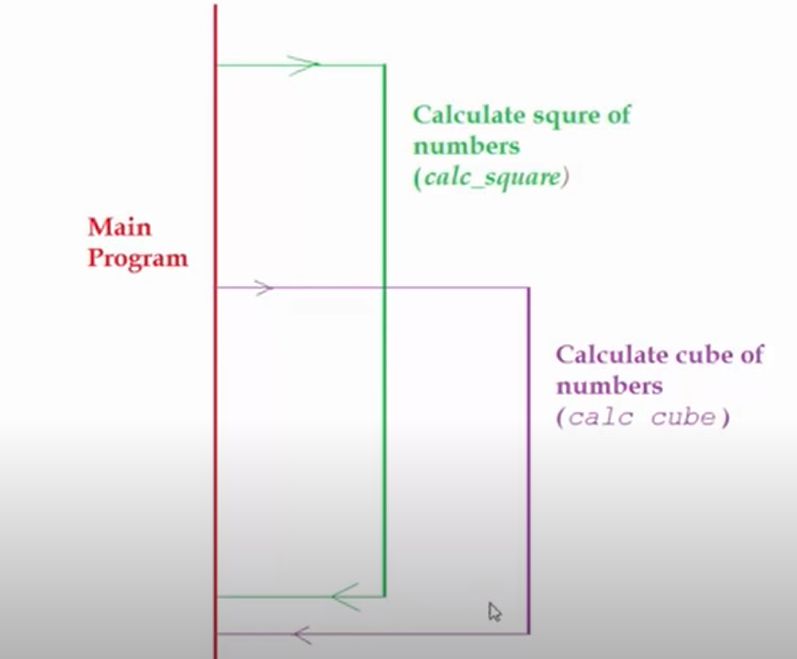
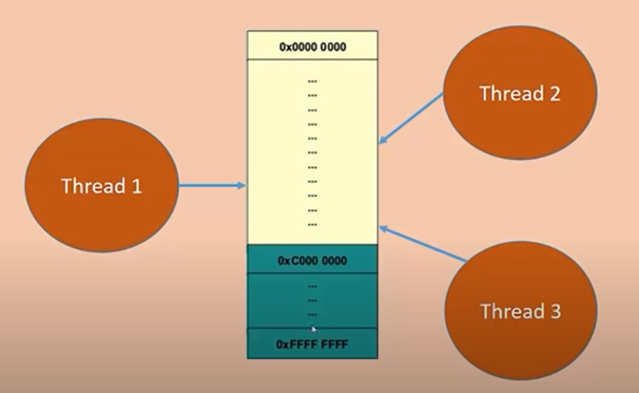
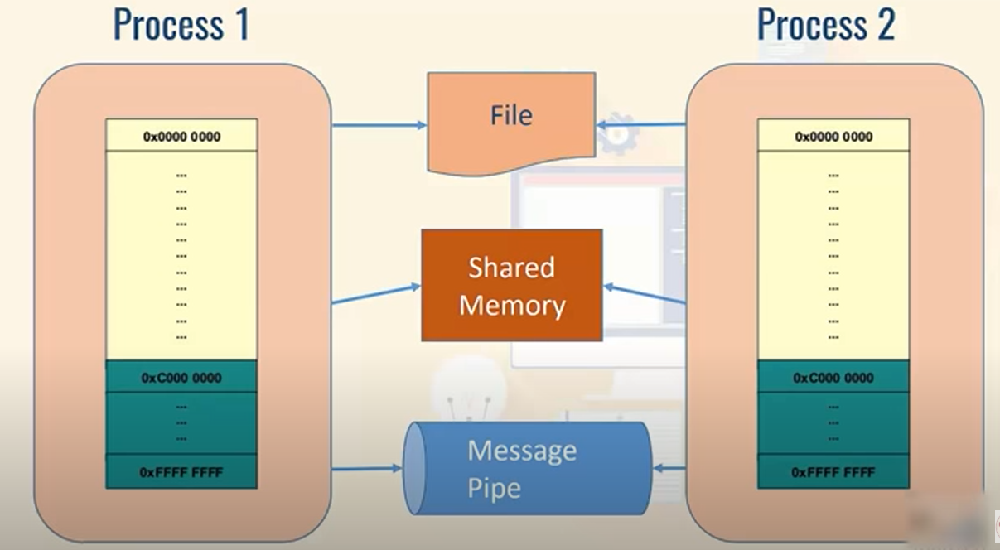
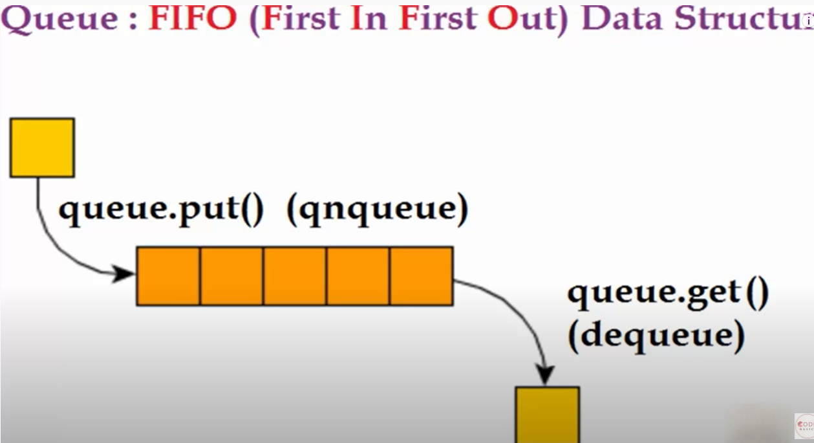
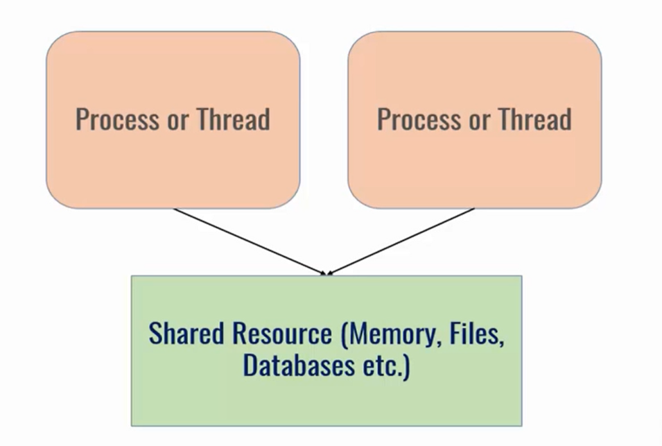
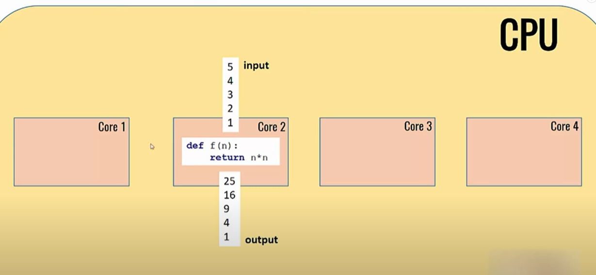
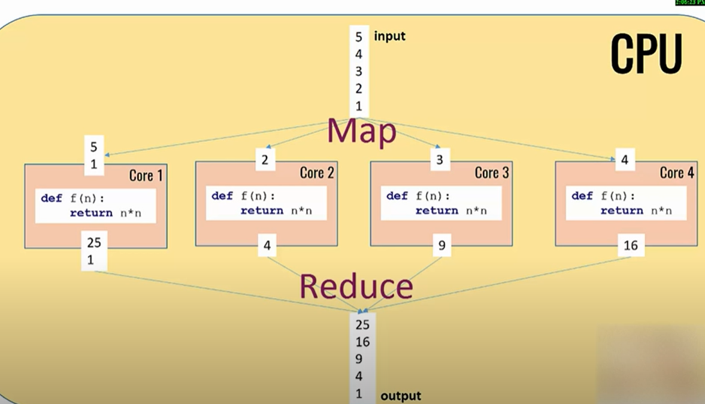

## Multiprocessing in Python Guide

> Based on the tutorial by DataFlair: https://data-flair.training/blogs/python-multiprocessing/

---

### Python Multiprocessing Process Class

Let’s talk about the Process class in Python Multiprocessing first. This is an abstraction to set up another process and lets the parent application control execution. Here, we observe the start() and join() methods. Let’s first take an example.

NOTE: accessing global vars is not so straightforward inside the individual processes

This is because each process starts of simultanously. So at the start each has the value `[None, None, None, None]` as value of `global_var_list`, so the first process modifies it as `[True, None, None, None]`, the second as `[None, True, None, None]` and not `[True, True, None, None]`

Code:

``` python

import multiprocessing
from multiprocessing import Process
import random

global_var_list = [None]*4


def heavy_op1(i,n):
    """
    simple resource intensive function
    """
    global global_var_list
    print (f'Started with n: {n}')
    print (f'Setting global var at idx: {i-1}')
    global_var_list[i-1] = True
    x = sorted([random.random() for i in range(n)])
    print ('Function idx: ', i, len(x))
    print ('Function idx: ',i, global_var_list)


def main():
    p1 = Process(target=heavy_op1, args=(1, 10000000,))
    p2 = Process(target=heavy_op1, args=(2, 70000000,))
    p3 = Process(target=heavy_op1, args=(3, 40000000,))
    p4 = Process(target=heavy_op1, args=(4, 20000000,))
    ### start the processes
    p1.start()
    p2.start()
    p3.start()
    p4.start()
    ### stop execution
    p1.join()
    p2.join()
    p3.join()
    p4.join()
    print("We're done")
    print ('Global var at end of processing:', global_var_list)
if __name__=="__main__":
    main()
```

Output:

```
Started with n: 70000000
Setting global var at idx: 1
Started with n: 10000000
Setting global var at idx: 0
Started with n: 20000000
Setting global var at idx: 3
Started with n: 40000000
Setting global var at idx: 2
Function idx:  1 10000000
Function idx:  1 [True, None, None, None]
Function idx:  4 20000000
Function idx:  4 [None, None, None, True]
Function idx:  3 40000000
Function idx:  3 [None, None, True, None]
Function idx:  2 70000000
Function idx:  2 [None, True, None, None]
We're done
Global var at end of processing: [None, None, None, None]
```

Let’s understand this piece of code. Process() lets us instantiate the Process class. start() tells Python to begin processing. But then if we let it be, it consumes resources and we may run out of those at a later point in time. This is because it lets the process stay idle and not terminate. To avoid this, we make a call to join(). With this, we don’t have to kill them manually. Join stops execution of the current program until a process completes. This makes sure the program waits for p1 to complete and then p2 to complete. Then, it executes the next statements of the program. One last thing, the args keyword argument lets us specify the values of the argument to pass. Also, target lets us select the function for the process to execute.

### Getting Information about Processes

We may want to get the ID of a process or that of one of its child. We may also want to find out if it is still alive. The following program demonstrates this functionality:

Code:

``` python

def heavy_op1(i,n):
    """
    simple resource intensive function
    """
    print (f'Started with n: {n}')
    x = sorted([random.random() for i in range(n)])
    print ('Function idx: ', i, len(x))
    print (f'Function pid: {os.getpid()}')


def main():
    print (f'Parent id: {os.getpid()}')
    p1 = Process(target=heavy_op1, args=(1, 40000000,))
    p2 = Process(target=heavy_op1, args=(2, 60000000,))
    ### start the processes
    p1.start()
    p2.start()
    
    ### both processes should be alive as the statement is before join()
    print (f'p1 alive:? {p1.is_alive()}') 
    print (f'p2 alive:? {p2.is_alive()}')
    ### stop execution
    p1.join()
    p2.join()
    
    print("We're done")
if __name__=="__main__":
    main()
```

Output:

```
Parent id: 21376
p1 alive:? True
p2 alive:? True
Started with n: 60000000
Started with n: 40000000
Function idx:  1 40000000
Function pid: 7816
Function idx:  2 60000000
Function pid: 16060
We're done
```

Here the `is_alive()` condition was checked before the `join()` methods so for both functions `True` was returned

If we change the order slightly:

``` python


def main():
    print (f'Parent id: {os.getpid()}')
    p1 = Process(target=heavy_op1, args=(1, 40000000,))
    p2 = Process(target=heavy_op1, args=(2, 60000000,))
    ### start the processes
    p1.start()
    p2.start()
    
    ### p2 alive True p1 alive False
    print (f'p2 alive:? {p2.is_alive()}')
    ### stop execution
    p1.join()
    print (f'p1 alive:? {p1.is_alive()}') 
    p2.join()
    
    print("We're done")
```

Output:

```
Parent id: 6740
p2 alive:? True
Started with n: 40000000
Started with n: 60000000
Function idx:  1 40000000
Function pid: 20676
p1 alive:? False
Function idx:  2 60000000
Function pid: 16392
We're done
```

Similarly 

``` python
def main():
    print (f'Parent id: {os.getpid()}')
    p1 = Process(target=heavy_op1, args=(1, 40000000,))
    p2 = Process(target=heavy_op1, args=(2, 60000000,))
    ### start the processes
    p1.start()
    p2.start()
    
    ### stop execution
    p1.join()
     ### p2 alive False p1 alive False
    print (f'p1 alive:? {p1.is_alive()}') 
    p2.join()
    print (f'p2 alive:? {p2.is_alive()}')
    
    print("We're done")

```
Output:

```
Parent id: 12276
Started with n: 60000000
Started with n: 40000000
Function idx:  1 40000000
Function pid: 1732
p1 alive:? False
Function idx:  2 60000000
Function pid: 18356
p2 alive:? False
We're done
```

> So basically each process is alive before the join statements are executed. This is a handy way to check if they are still executing or not

We can also set names for processes so we can retrieve them when we want. This is to make it more human-readable.

First we need to import the method:

``` python
from multiprocessing import Process, current_process
```
``` python
def heavy_op1(i,n):
    """
    simple resource intensive function
    """
    print (f'Started with n: {n}')
    x = sorted([random.random() for i in range(n)])
    print (f'Function idx: {i}, length: {len(x)}, function name: {current_process().name}')
    print (f'Function pid: {os.getpid()}')


def main():
    print (f'Parent id: {os.getpid()}')
    p1 = Process(target=heavy_op1, args=(1, 40000000,), name='process 1')
    p2 = Process(target=heavy_op1, args=(2, 60000000,), name='process 2')
    ### start the processes
    p1.start()
    p2.start()
    
    ### stop execution
    p1.join()
     ### p2 alive False p1 alive False
    print (f'p1 alive:? {p1.is_alive()}') 
    p2.join()
    print (f'p2 alive:? {p2.is_alive()}')
    
    print("We're done")
```

Output:

```
Parent id: 13892
Started with n: 60000000
Started with n: 40000000
Function idx: 1, length: 40000000, function name: process 1
Function pid: 19904
p1 alive:? False
Function idx: 2, length: 60000000, function name: process 2
Function pid: 19200
p2 alive:? False
We're done
```

## Advanced Multiprocessing Concepts

> Based on the amazing videos by CodeBasics - https://www.youtube.com/channel/UCh9nVJoWXmFb7sLApWGcLPQ

### Multiprocessing vs Multithreading

In a program there might be instances when your cpu is idle. You might be waiting for response from an API, during that time, instead of staying idle, you can utilize the cpu using multithreading.

In multithreading, there is only one core process (here pid of )




> Multithreading is really useful for IO bound operations when the CPU is just waiting to get back a response and we can do other stuff while CPU is idle. But if you want to do some CPU-intensive work that utilizes multiple cores, we need to use multiprocessing

> Threads are lightweight while processes are heavyweight

> A benefit of  multiprocessing is that error or memory leak in one process wont hurt execution of another process

### Multithreading example

We want to calculate sqs and cubes of a set of numbers:

```python

def calc_squares(numbers):
    print ('calculating sqs...')
    for n in numbers:
        time.sleep(0.2)
        print (f'sq of {n} is {n**2}')

def calc_cubes(numbers):
    print ('calculating cubes...')
    for n in numbers:
        time.sleep(0.2)
        print (f'cube of {n} is {n**3}')

```

Notice the sleep time while calculating each sq or cube.
The sequential version of the program takes 1.6 s to complete

> So before the cpu is computing the sq of 2 it stays idle for 0.2s during which it can perform another operation, say calculate the cube of 2, for example. We can achieve this through threading  

``` python
## create 2 threads
t1 = threading.Thread(target=calc_squares, args=(arr, ))
t2 = threading.Thread(target=calc_cubes, args=(arr, ))
## start the threads: executes the 2 functions in parallel
t1.start()
t2.start()
## join: wait until that particular thread is done]
t1.join()
t2.join()
```

Output:

```
calculating sqs...
calculating cubes...
sq of 2 is 4
cube of 2 is 8
sq of 3 is 9
cube of 3 is 27
sq of 8 is 64
cube of 8 is 512
sq of 9 is 81
cube of 9 is 729
Completed in 0.8045973777770996 seconds
```




### Multithreading and global variables

We have already seen that we cannot rely on global vars in multiprocessing as each process has its own virtual memory address which is different from that of the main memory.

Let us inspect whether this is the same for multithreading:


Threads share the same address space as the main program, so the global variables can be acessed by them



For multiprocessing, they have their own address spaces and if they want to communicate, they can do so via

1. A file on disk
2. Shared memory
3. Message pipe



### Sharing Data Between Processes Using Array and Value

New process gets its own address space. We can solve this by using **shared memory**

#### Using Array

```python
def calc_squares(numbers, result):
    for idx, n in enumerate(numbers):
        result[idx] = n**2
    print (f'Within process: {result[:]}')

if __name__=="__main__":
    numbers = [2,3,5]
    # create a shared memory var
    result = multiprocessing.Array('i', 3)
    p = multiprocessing.Process(target=calc_squares, args=(numbers, result))

    p.start()
    p.join()

    print(f'Outside process {result[:]}')
```

#### Using value

```python
def calc_squares(numbers, result, value):
    value.value = 5.0
    for idx, n in enumerate(numbers):
        result[idx] = n**2
    print (f'Within process: {result[:]}, {value.value}')

if __name__=="__main__":
    numbers = [2,3,5]
    # create a shared memory var
    result = multiprocessing.Array('i', 3)
    value = multiprocessing.Value('d', 0.0)
    p = multiprocessing.Process(target=calc_squares, args=(numbers, result, value))

    p.start()
    p.join()

    print(f'Outside process {result[:]},{value.value}')
```

Output:
```
Within process: [4, 9, 25], 5.0
Outside process [4, 9, 25],5.0
```

### Sharing Data Between Processes Using Queue


We saw that there are multiple ways by which processes can share data:


Queue is basically **shared memory**



Code:

``` python
def calc_squares(i, numbers, q):
    for idx, n in enumerate(numbers):
        # push to queue
        q.put({'idx': idx, 'n_sq': str(n**2)})

if __name__=="__main__":
    numbers1, numbers2 = [2,3,5], [5,6,7]
    
    # create two queues
    q1 = multiprocessing.Queue()
    q2 = multiprocessing.Queue()

    # create 2 processes
    p1 = multiprocessing.Process(target=calc_squares, args=(1, numbers1, q1))
    p2 = multiprocessing.Process(target=calc_squares, args=(2, numbers2, q2))

    p1.start()
    p2.start()

    p1.join()
    p2.join()

    while not q1.empty():
        print (f'Within main: {q1.get()}')
    while not q2.empty():
        print (f'Within main: {q2.get()}')

    print (f'Is q1 empty: {q1.empty()}')
    print (f'Is q2 empty: {q2.empty()}')

    print ('End of main...')
```

Output:

```
Within main: {'idx': 0, 'n_sq': '4'}
Within main: {'idx': 1, 'n_sq': '9'}
Within main: {'idx': 2, 'n_sq': '25'}
Within main: {'idx': 0, 'n_sq': '25'}
Within main: {'idx': 1, 'n_sq': '36'}
Within main: {'idx': 2, 'n_sq': '49'}
Is q1 empty: True
Is q2 empty: True
End of main...
```

> NOTE: One we apply `.get()` method on the queue, the elements are popped out. So if we put the while loop inside the
`calc_squares` function, the queue will be empty in the main as it is shared memory

> Also queues can store complex python objects as we have stored dictionaries here

### Multiprocessing Lock

Why do we need a lock?

In real life we need a lock when multiple people are looking to access a shared resource, like a toilet

In CS, whenever 2 processes or threads are trying to access a shared resource (like shared memory, files or db) it can create problems
So, we need to protect that access using a lock




``` python

def deposit(balance):
    for i in range(100):
        time.sleep(0.1)
        balance.value = balance.value + 1
def withdraw(balance):
    for i in range(100):
        time.sleep(0.1)
        balance.value = balance.value - 1

if __name__=="__main__":
    # init balance
    balance = multiprocessing.Value('i', 200)

    d = multiprocessing.Process(target=deposit, args=(balance, ))
    w = multiprocessing.Process(target=withdraw, args=(balance, ))

    d.start()
    w.start()

    d.join()
    w.join()

    print (f'Final balance: {balance.value}')

```

This is an example of a simple banking sw. We have 2 processes accessing a shared var

One process deposits 1 Re 100 times and the other withdraws 1 Re 100 times

So ideally we would expect the same balance at the end

But it is not the case

Sample Outputs:
```
Final balance: 195
Final balance: 202
Final balance: 181
```

Why does this happen?

- Say initially balance is 200
- The deposit process reads 200 as value and increments 1 and has to put it back into the same var
- At an OS level this simple operation has multiple assemply line instructions like
```
    READ balance
    ADD 1
    SET balance to balance + 1
    WRITE back balance
```
- While this process was executing the withdraw process also read balance value and instead of 201 it read it as 200 and wrote back 199

This is one simple case inconsistency might occur due to accessing shared variable

#### Critical Section

Whichever part of your code accesses the shared variable, is called a CS

Before accessing the CS, we should acquire a lock and after the CS is done, we release the lock

Code:

```python

def deposit(balance, lock):
    for i in range(100):
        time.sleep(0.1)
        ### CS start : acquire lock
        lock.acquire()
        balance.value = balance.value + 1
        ### CS end: release lock
        lock.release()
def withdraw(balance, lock):
    for i in range(100):
        time.sleep(0.1)
        ### CS start : acquire lock
        lock.acquire()
        balance.value = balance.value - 1
        ### CS end: release lock
        lock.release()

if __name__=="__main__":
    # init balance
    balance = multiprocessing.Value('i', 200)

    ## init a lock
    lock = multiprocessing.Lock()

    d = multiprocessing.Process(target=deposit, args=(balance, lock))
    w = multiprocessing.Process(target=withdraw, args=(balance, lock))

    d.start()
    w.start()

    d.join()
    w.join()

    print (f'Final balance: {balance.value}')

```

Now everytime op will be 200

### Multiprocessing Pool (Map Reduce)

Say we have a program to calculate sq of the numbers: `[1,2,3,4,5]`


Typically when we write a function and execute it, only 1 core of CPU will be used




But we can divide up the work and use multiple cores



The process of dividing the ip bw multiple cores is called **map**

The process of aggregating the results back is called **reduce**


Code:

```python
def f(n):
    sum=0
    for x in range(10000):
        sum+=x**2
    return sum

if __name__ == "__main__":
    t1 = time.time()
    p = Pool()
    # map is used to divide the work into multiple cores
    # this will automatically div the work among all cpu cores
    # and it will return the result
    result = p.map(func=f, iterable=range(10000))
    p.close()
    p.join()

    print (f'Pool took {time.time() - t1}s')
    print (f'Result sum: {sum(result)}')

    t2 = time.time()
    result = []
    for x in range(10000):
        result.append(f(x))

    print(f'Serial operaltion took {time.time() - t2}s')
    print (f'Result sum: {sum(result)}')
```

Output:

```
Pool took 22.81440305709839s
Result sum: 3332833350000000
Serial operaltion took 95.67702722549438s
Result sum: 3332833350000000
```

We can see Pool was significantly faster

Pool has an argument processes by which we can explicitly set the number of processes to create